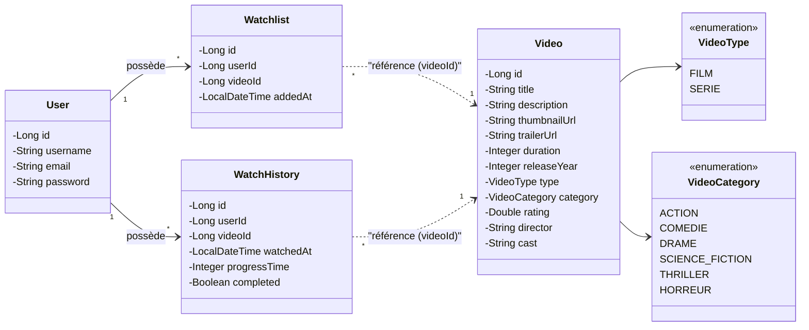
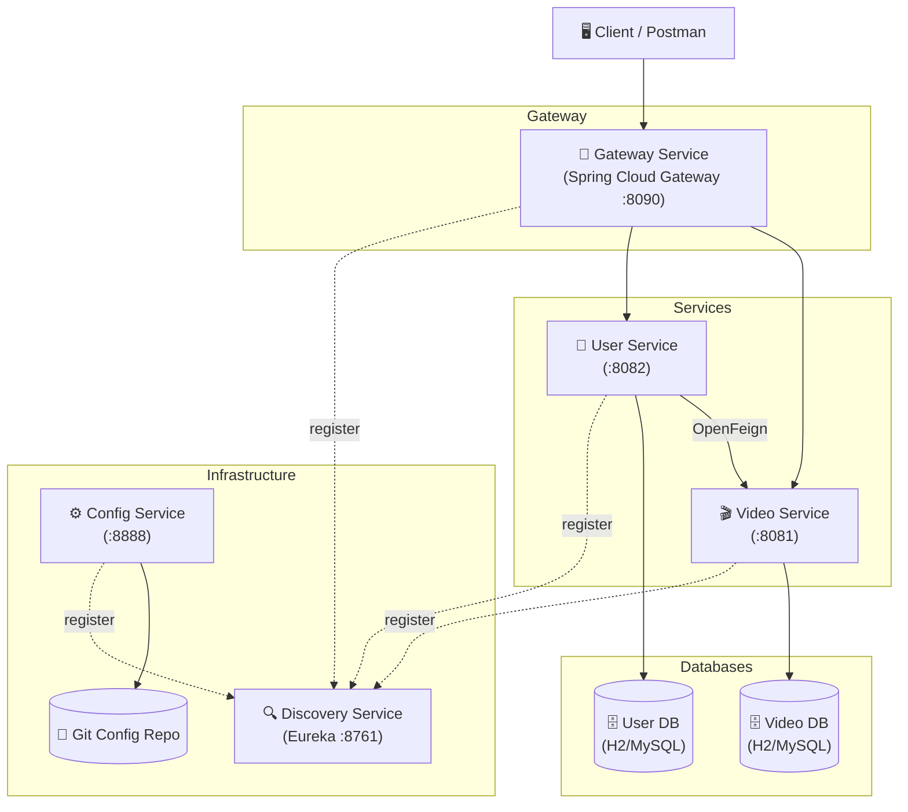

# 📐 StreamForge — Diagramme de Classe

## Diagramme Complet (Entities + Architecture)

```mermaid
classDiagram
    direction TB

    %% ============================
    %% VIDEO SERVICE
    %% ============================

    namespace VideoService {
        class Video {
            -Long id
            -String title
            -String description
            -String thumbnailUrl
            -String trailerUrl
            -Integer duration
            -Integer releaseYear
            -VideoType type
            -VideoCategory category
            -Double rating
            -String director
            -String cast
        }

        class VideoType {
            <<enumeration>>
            FILM
            SERIE
        }

        class VideoCategory {
            <<enumeration>>
            ACTION
            COMEDIE
            DRAME
            SCIENCE_FICTION
            THRILLER
            HORREUR
        }

        class VideoRequestDTO {
            -String title
            -String description
            -String thumbnailUrl
            -String trailerUrl
            -Integer duration
            -Integer releaseYear
            -VideoType type
            -VideoCategory category
            -Double rating
            -String director
            -String cast
        }

        class VideoResponseDTO {
            -Long id
            -String title
            -String description
            -String thumbnailUrl
            -String trailerUrl
            -Integer duration
            -Integer releaseYear
            -VideoType type
            -VideoCategory category
            -Double rating
            -String director
            -String cast
        }

        class VideoMapper {
            +toEntity(VideoRequestDTO) Video
            +toResponseDTO(Video) VideoResponseDTO
            +updateEntity(Video, VideoRequestDTO) void
        }

        class VideoRepository {
            <<interface>>
            +findByType(VideoType) List~Video~
            +findByCategory(VideoCategory) List~Video~
            +findByTitleContainingIgnoreCase(String) List~Video~
            +findByDirectorContainingIgnoreCase(String) List~Video~
            +findByRatingGreaterThanEqual(Double) List~Video~
        }

        class VideoService {
            <<interface>>
            +createVideo(VideoRequestDTO) VideoResponseDTO
            +getVideoById(Long) VideoResponseDTO
            +getAllVideos() List~VideoResponseDTO~
            +updateVideo(Long, VideoRequestDTO) VideoResponseDTO
            +deleteVideo(Long) void
            +getVideosByType(VideoType) List~VideoResponseDTO~
            +getVideosByCategory(VideoCategory) List~VideoResponseDTO~
            +searchVideosByTitle(String) List~VideoResponseDTO~
            +getVideosByDirector(String) List~VideoResponseDTO~
            +getVideosByMinRating(Double) List~VideoResponseDTO~
        }

        class VideoServiceImpl {
            -VideoRepository videoRepository
            -VideoMapper videoMapper
        }

        class VideoController {
            -VideoService videoService
            +createVideo(VideoRequestDTO) ResponseEntity
            +getVideoById(Long) ResponseEntity
            +getAllVideos() ResponseEntity
            +updateVideo(Long, VideoRequestDTO) ResponseEntity
            +deleteVideo(Long) ResponseEntity
            +getVideosByType(VideoType) ResponseEntity
            +getVideosByCategory(VideoCategory) ResponseEntity
            +searchVideosByTitle(String) ResponseEntity
            +getVideosByDirector(String) ResponseEntity
            +getVideosByMinRating(Double) ResponseEntity
        }

        class ResourceNotFoundException_Video {
            -String resourceName
            -String fieldName
            -Object fieldValue
        }

        class GlobalExceptionHandler_Video {
            +handleResourceNotFound() ResponseEntity
            +handleValidationErrors() ResponseEntity
            +handleGenericException() ResponseEntity
        }
    }

    %% ============================
    %% USER SERVICE
    %% ============================

    namespace UserService {
        class User {
            -Long id
            -String username
            -String email
            -String password
            -List~Watchlist~ watchlist
            -List~WatchHistory~ watchHistory
        }

        class Watchlist {
            -Long id
            -Long userId
            -Long videoId
            -LocalDateTime addedAt
            -User user
        }

        class WatchHistory {
            -Long id
            -Long userId
            -Long videoId
            -LocalDateTime watchedAt
            -Integer progressTime
            -Boolean completed
            -User user
        }

        class UserRequestDTO {
            -String username
            -String email
            -String password
        }

        class UserResponseDTO {
            -Long id
            -String username
            -String email
        }

        class WatchlistResponseDTO {
            -Long id
            -Long userId
            -Long videoId
            -LocalDateTime addedAt
            -VideoDTO video
        }

        class WatchHistoryRequestDTO {
            -Long videoId
            -Integer progressTime
            -Boolean completed
        }

        class WatchHistoryResponseDTO {
            -Long id
            -Long userId
            -Long videoId
            -LocalDateTime watchedAt
            -Integer progressTime
            -Boolean completed
            -VideoDTO video
        }

        class VideoDTO {
            -Long id
            -String title
            -String description
            -String thumbnailUrl
            -String trailerUrl
            -Integer duration
            -Integer releaseYear
            -String type
            -String category
            -Double rating
            -String director
            -String cast
        }

        class UserStatsDTO {
            -Long userId
            -String username
            -Long totalVideosWatched
            -Long totalWatchTimeMinutes
            -Long completedVideos
            -Long watchlistSize
            -Double completionRate
        }

        class UserMapper {
            +toEntity(UserRequestDTO) User
            +toResponseDTO(User) UserResponseDTO
            +toWatchlistResponseDTO(Watchlist, VideoDTO) WatchlistResponseDTO
            +toWatchHistoryResponseDTO(WatchHistory, VideoDTO) WatchHistoryResponseDTO
        }

        class UserRepository {
            <<interface>>
            +findByUsername(String) Optional~User~
            +findByEmail(String) Optional~User~
            +existsByUsername(String) boolean
            +existsByEmail(String) boolean
        }

        class WatchlistRepository {
            <<interface>>
            +findByUserId(Long) List~Watchlist~
            +findByUserIdAndVideoId(Long, Long) Optional~Watchlist~
            +existsByUserIdAndVideoId(Long, Long) boolean
            +countByUserId(Long) long
        }

        class WatchHistoryRepository {
            <<interface>>
            +findByUserIdOrderByWatchedAtDesc(Long) List~WatchHistory~
            +countByUserId(Long) long
            +countByUserIdAndCompletedTrue(Long) long
            +sumProgressTimeByUserId(Long) Long
        }

        class UserServiceInterface {
            <<interface>>
            +createUser(UserRequestDTO) UserResponseDTO
            +getUserById(Long) UserResponseDTO
            +getAllUsers() List~UserResponseDTO~
            +updateUser(Long, UserRequestDTO) UserResponseDTO
            +deleteUser(Long) void
            +addToWatchlist(Long, Long) WatchlistResponseDTO
            +removeFromWatchlist(Long, Long) void
            +getWatchlist(Long) List~WatchlistResponseDTO~
            +recordWatchHistory(Long, WatchHistoryRequestDTO) WatchHistoryResponseDTO
            +getWatchHistory(Long) List~WatchHistoryResponseDTO~
            +getUserStats(Long) UserStatsDTO
        }

        class UserServiceImpl {
            -UserRepository userRepository
            -WatchlistRepository watchlistRepository
            -WatchHistoryRepository watchHistoryRepository
            -VideoClient videoClient
            -UserMapper userMapper
        }

        class UserController {
            -UserServiceInterface userService
            +createUser(UserRequestDTO) ResponseEntity
            +getAllUsers() ResponseEntity
            +getUserById(Long) ResponseEntity
            +updateUser(Long, UserRequestDTO) ResponseEntity
            +deleteUser(Long) ResponseEntity
            +getUserStats(Long) ResponseEntity
        }

        class WatchlistController {
            -UserServiceInterface userService
            +addToWatchlist(Long, Long) ResponseEntity
            +removeFromWatchlist(Long, Long) ResponseEntity
            +getWatchlist(Long) ResponseEntity
        }

        class WatchHistoryController {
            -UserServiceInterface userService
            +recordHistory(Long, WatchHistoryRequestDTO) ResponseEntity
            +getHistory(Long) ResponseEntity
        }

        class VideoClient {
            <<interface>>
            +getVideoById(Long) VideoDTO
        }

        class VideoClientFallback {
            +getVideoById(Long) VideoDTO
        }

        class ResourceNotFoundException_User {
            -String resourceName
            -String fieldName
            -Object fieldValue
        }

        class ResourceAlreadyExistsException {
            -String message
        }
    }

    %% ============================
    %% RELATIONSHIPS - Video Service
    %% ============================
    Video --> VideoType : type
    Video --> VideoCategory : category
    VideoMapper ..> Video : creates/maps
    VideoMapper ..> VideoRequestDTO : reads
    VideoMapper ..> VideoResponseDTO : creates
    VideoRepository ..> Video : manages
    VideoServiceImpl ..|> VideoService : implements
    VideoServiceImpl --> VideoRepository : uses
    VideoServiceImpl --> VideoMapper : uses
    VideoController --> VideoService : uses

    %% ============================
    %% RELATIONSHIPS - User Service
    %% ============================
    User "1" --> "*" Watchlist : has
    User "1" --> "*" WatchHistory : has
    UserMapper ..> User : creates/maps
    UserMapper ..> UserRequestDTO : reads
    UserMapper ..> UserResponseDTO : creates
    UserMapper ..> WatchlistResponseDTO : creates
    UserMapper ..> WatchHistoryResponseDTO : creates
    UserRepository ..> User : manages
    WatchlistRepository ..> Watchlist : manages
    WatchHistoryRepository ..> WatchHistory : manages
    UserServiceImpl ..|> UserServiceInterface : implements
    UserServiceImpl --> UserRepository : uses
    UserServiceImpl --> WatchlistRepository : uses
    UserServiceImpl --> WatchHistoryRepository : uses
    UserServiceImpl --> VideoClient : uses
    UserServiceImpl --> UserMapper : uses
    VideoClientFallback ..|> VideoClient : implements
    UserController --> UserServiceInterface : uses
    WatchlistController --> UserServiceInterface : uses
    WatchHistoryController --> UserServiceInterface : uses

    %% ============================
    %% INTER-SERVICE COMMUNICATION
    %% ============================
    VideoClient ..> VideoDTO : returns
    VideoClient --|> VideoController : "OpenFeign HTTP call"
```

## Diagramme Simplifié — Entités Seulement



## Diagramme d'Architecture des Services


